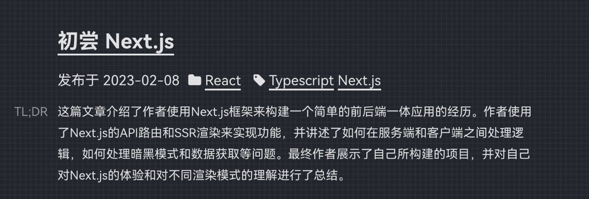
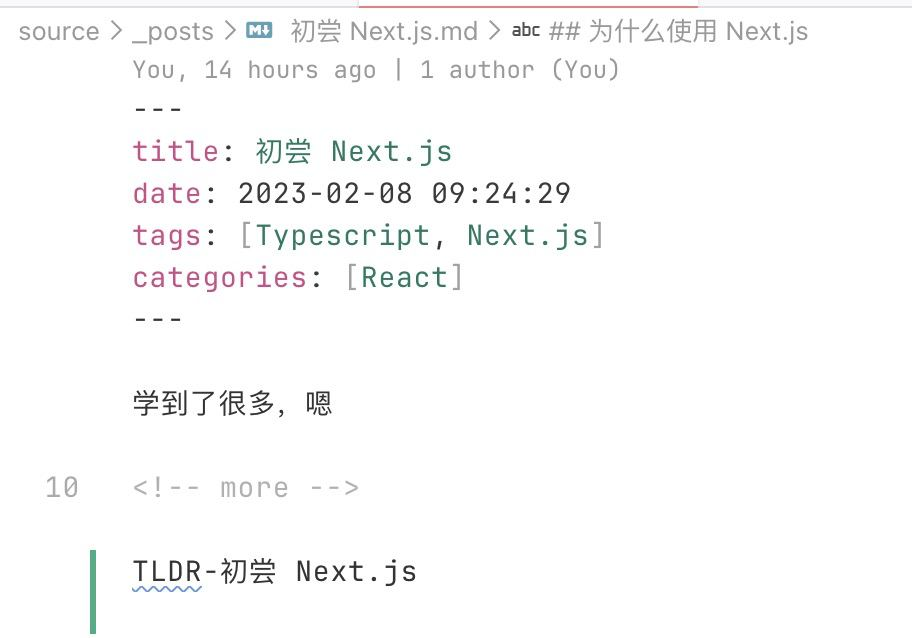

<h1 align="center">ChatGPT Summary</h1>

## 介绍

一个使用 ChatGPT 来生成博文总结的 Hexo 插件。效果如下图



## 使用方法

### 安装插件

```bash
npm install hexo-chatgpt-summary
```

### 配置选项

在 `_config.yml` 文件中添加如下可选项

```yml
chatgpt_summary:
  enable: true
  # token 和 api key 任选其一
  apiKey: xxx
  # accessToken:
  # customPosition: tldr-content # 唯一的元素 ID
```

注释都是可选项

### 配置需要生成总结的文章

在需要生成总结的文章的源文件中，加入 `TLDR-文章标题` 如下图。注意要放在 `<!-- more -->` 的下方



### 使用 `chatgpt` 命令

配置好后，在命令行中运行 `hexo chatgpt` 命令，此时会自动生成标记文章的总结，将其保存在博客根目录中的 `summary.json` 文件中。可以检查是否成功生成了对应的总结

使用 `hexo cl && hexo s` 查看效果

## 注意

生成的总结默认会插入在正文的上方，如果你想自定义插入的位置，需要配置选项中的 `customPosition`，给一个唯一的元素 `id` 并且在模版文件中添加一个 `<div id="你提供的唯一的元素 id"></div>` 锚点

默认生成的 html 结构如下，可根据喜好自行编写 css 样式，或
使用我提供的默认样式

```html
<div class="tldr">
  <p class="tldr-content">xxx</p>
</div>
```

```css
/* 添加到样式文件夹中 */
.tldr-content {
  font-size: 14px;
}

.tldr-content::before {
  content: 'TL;DR';
  opacity: 0.6;
  position: absolute;
  left: -50px;
}
```

由于 `token` 和 `apiKey` 都是填写在 `_config.yml` 文件中，如果你使用 GitHub 托管博客，请注意每次生成完后将其删除，以防泄漏。

这个插件也是迎合最近火热的 ChatGPT，处于好玩的性质做的。可能在你的博客中会出现各类问题导致无法使用（都怪菜鸡写的破烂代码啦）所以请多多包涵。

同时欢迎提 issue 和 pr

## License

MIT
